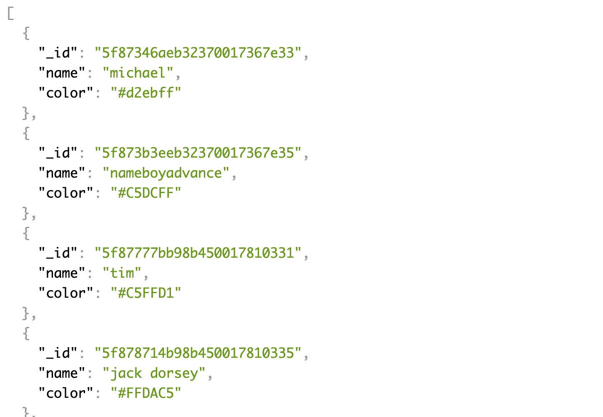

# Twitter Clone
After completing [FullStackOpen](https://fullstackopen.com/en/) I wanted to work on a project to put all the backend skills that I learned to practice. I decided to work on a Twitter clone. The project began with the simple functionality, but after completing the base functions I kept adding to it.

---

## Technology Used
In order to create this app I used React and Redux in the front end, and Node and Express in the backend. MongoDB was used to store the information on the database from the backend.

---

## Entry Page
When you go on the web app the first thing you see is the list of posts from all users. The posts can be written after signing up for an account or logging in with a previous account with the buttons on the sidebar. On the bottom of the search bar is a searchfield that can be used to look for posts with a specific hashtag.

---

## Backend Authorization
The passwords are encrypted so no plain password is stored on the Database which will never be known by anyone other than the user. Once logged in a token from the Database is stored locally in order for you to stay logged in even after the page being closed or refreshed.

---

## Hashtags

---

## Search
On the bottom of the sidebar is a search field. Hashtags can be search with plain hashtag name or by using the # symbol infront of name. You can also search for more than one hashtag at a time. If you want to narrow your search to posts that only include those hashtags then you need to use either the & symbol or the word 'and'.

---

## Comments and Likes