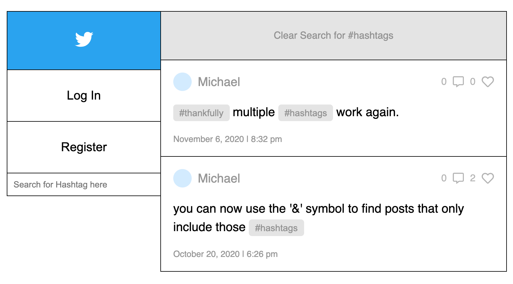
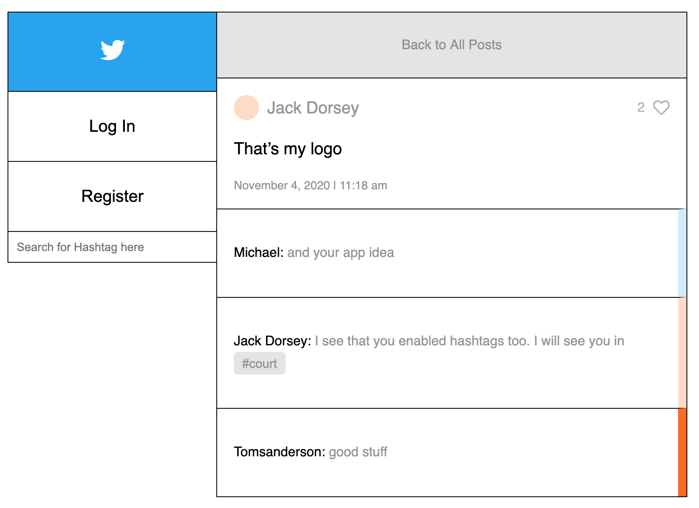

# Twitter Clone
After completing [FullStackOpen](https://fullstackopen.com/en/) I wanted to work on a project to put all the backend skills that I learned to practice. I decided to work on a Twitter clone. The project began with the simple functionality, but after completing the base functions I kept adding to it.

## Technology Used
In order to create this app I used React and Redux in the front end, and Node and Express in the backend. MongoDB was used to store the information on the database from the backend.

## Entry Page

When you go on the web app the first thing you see is the list of posts from all users. The posts can be written after signing up for an account or logging in with a previous account with the buttons on the sidebar. On the bottom of the search bar is a searchfield that can be used to look for posts with a specific hashtag.

## Backend Authorization

The passwords are encrypted so no plain password is stored on the Database which will never be known by anyone other than the user. Once logged in a token from the Database is stored locally in order for you to stay logged in even after the page being closed or refreshed. What is really being sent back from the server is a token and the userId. The token will be used to take any actions from the website and the userId will be used to display your profile information on the appropriate places in the app.

## Hashtags and Mentions

Hashtags are an important part of twitter. They help label posts for future reference and to group them together with other people who want to speak on the same topic. In this twttr clone when you write a post if you add a # symbol in front of it. In the same way if you add an @ symbol in front of the text the word will appear as a mention highlighting the name with the color the user uses as their profile identifier color.

## Search

On the bottom of the sidebar is a search field. Hashtags can be search with plain hashtag name or by using the # symbol infront of name. You can also search for more than one hashtag at a time. If you want to narrow your search to posts that only include those hashtags then you need to use either the & symbol or the word 'and'.

## Comments and Likes

Every post is able to keep track of comments and likes. The likes are kept as an array that includes the user's id to let me know if the person has liked the post before. The comments are also kept as an array including the comment author's id so the appropriate user can delete their own comment.

## Compose

In order to write a tweet you must first be logged in then the compose button will appear. Compose started off as a basic text field but after adding the highlighting on the posts for hashtags and mentions I decided to add the hightlighting inside of the compose to be shown in real time as the post is being written. When you start typing out a mention suggestions will also appear to help you make sure you are typing the person's name with correct spelling.

## Setup for testing

To run this project in your local project is very simple.

All you need to do is:
- Clone the project to your local machine.
- Run npm i to install all of the npm packages that are used.
- Before testing the app you need to have or create a MongoDb cluster. During this setup process you will create a username, password, and dbName that will be added to the api key. If you need help on how to setup this process check out [THIS tutorial](https://docs.atlas.mongodb.com/connect-to-cluster/).
- After you will need to come up with a string to encrypt and decrypt the tokens that will be used in the app. This string will be stored in the .env file and never seen by anyone other in order to keep a layer of security.
- Create a .env file in the root of the folder that has the keys stored to access the database and for the encryption of the token. The name of these keys must be 'MONGO_URL' for the Mongo api key and 'JWT_KEY' for the token key.
- Run 'npm run build' to build a production build that can be used to test the website.
- Then run 'npm run dev' to start up the server and local build.

> Enjoy and please leave some feedback on anything that's broken or can be improved.

